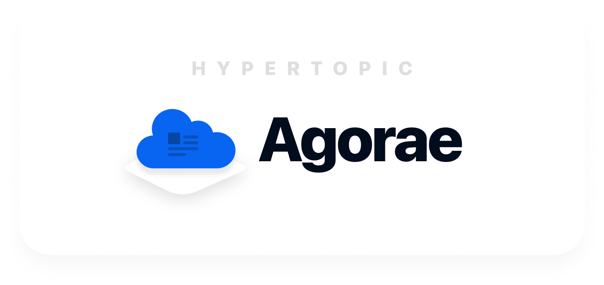

## Agorae – Participative knowledge management

 
  

  
 
 
 

## Introduction 

Agorae is a Participative knowledge management app that can be used for any organization and it is a common mapping device for a generic co-built knowledge map about transitions. This generic scheme is adaptable to specific requirements of each organisation facing transition goals. 

Agorae (this repository) is the Web side of the project that can be connected to an Argos Database and can be configured and customised following your needs by modifying `config/config.ts` 

### V2 : What's new for Agorae 

- ✨ Completely re-written in React + NextJS 
- ⛏ Written in Typescript 
- ⚡️ Higher performance 
- 👶🏻 Modern architecture 
- 🐛 Test-driven development with Jest 
- 👨🏻‍🎨 Custom new UI design

## Installation requirements 

- NodeJS v14+ 
- Argos V2

> To install Argos and know more about the Argos Project refer to : https://github.com/Hypertopic/Argos 

## Install Agorae V2 

Install the node packages : 

`npm install` 

You're installing it in a pipeline ? : 

`npm ci` 
## Dev Environment 

To run on a Dev-friendly (NextJS Dev) environment :

`npm run dev`

> Please refer to : https://nextjs.org/docs/api-reference/cli#development 
## Build project 

`npm run build`

`npm run start`

> Please refer to : https://nextjs.org/docs/api-reference/cli#production 

## Export the project 

`next export` allows you to export your app to static HTML, which can be run standalone without the need of a Node.js server.

The exported app supports almost every feature of Next.js, including dynamic routes, prefetching, preloading and dynamic imports.

> Please refer to : https://nextjs.org/docs/advanced-features/static-html-export 

## Testing the project  

- Write your checks/tests in the `tests` folder  
- Move to source project (`/`)
- Run `npm run test` to trigger the checks 

> Please refer to : https://jestjs.io/docs/getting-started 

